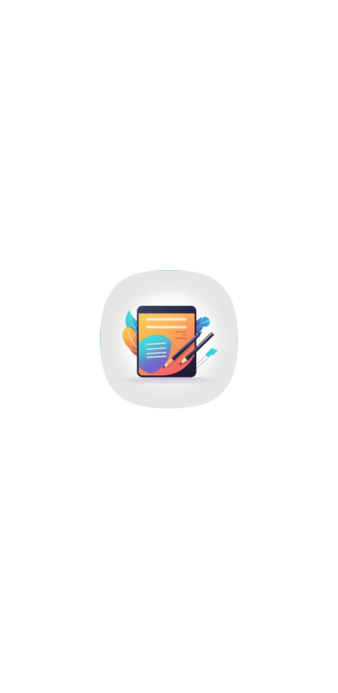
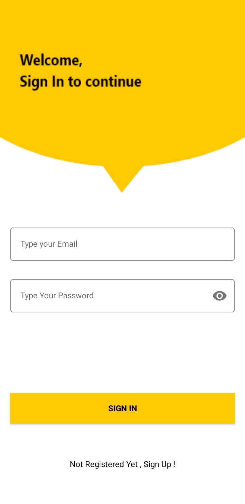
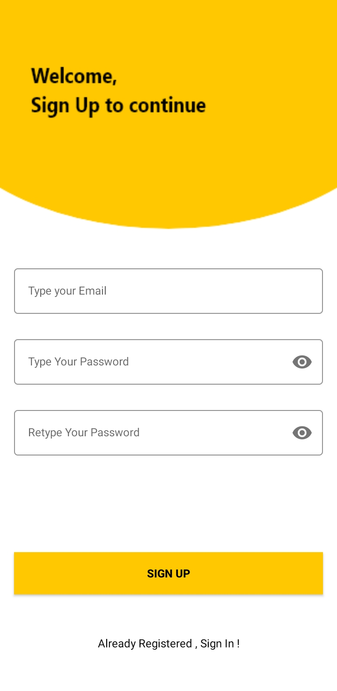
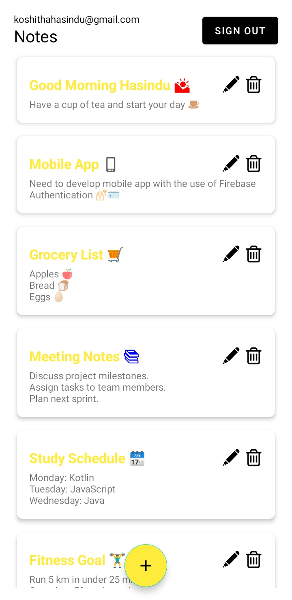

# Noteapp

Noteapp is a mobile application for managing personal notes. This app allows users to create, read, update, and delete notes, as well as manage their Firebase authentication.

## Features

- Create, read, update, and delete notes
- Firebase authentication
- User-specific note management
- Modern UI with Material Design components

## Screenshots

<div style="display: flex; justify-content: space-around;">
    <div style="text-align: center;">
        <p>Loading Screen</p>
        
    </div>
    <div style="text-align: center;">
        <p>SignIn Screen</p>
        
    </div>
    <div style="text-align: center;">
        <p>SignUp Screen</p>
        
    </div>
</div>

### Notes Screen


### Add Note Screen


### Edit Note Screen


## Installation

1. **Clone the repository:**

   git clone https://github.com/hasindu-k/Note-app.git
   cd noteapp

2. **Open the project in Android Studio.**

3. **Add the `google-services.json` file:**

   - Go to the [Firebase Console](https://console.firebase.google.com/).
   - Select or create a Firebase project.
   - Register your app with the package name `com.example.noteapp`.
   - Download the `google-services.json` file.
   - Place the `google-services.json` file in the `app/` directory.

4. **Sync the project with Gradle:**

   - Open the `build.gradle` files and ensure the dependencies are correctly listed.
   - Sync the project with Gradle files.

5. **Run the app:**

   - Connect an Android device or start an emulator.
   - Click the "Run" button in Android Studio.

## Usage

- **Login/Sign Up:** Use your email and password to log in or sign up.
- **Add Note:** Click the floating action button to add a new note.
- **View Notes:** All notes are displayed on the main screen.
- **Edit/Delete Note:** Long press a note to edit or delete it.
- **Logout:** Click the logout button to sign out.

## Project Structure

```plaintext
Noteapp/
├── app/
│   ├── src/
│   │   ├── main/
│   │   │   ├── java/com/example/noteapp/
│   │   │   │   ├── MainActivity.kt
│   │   │   │   ├── AddNoteActivity.kt
│   │   │   │   ├── NotesAdapter.kt
│   │   │   │   └── NotesDatabaseHelper.kt
│   │   │   ├── res/
│   │   │   │   ├── layout/
│   │   │   │   ├── drawable/
│   │   │   │   ├── values/
│   │   │   │   └── ...
│   │   └── ...
├── build.gradle
├── google-services.json
└── README.md
